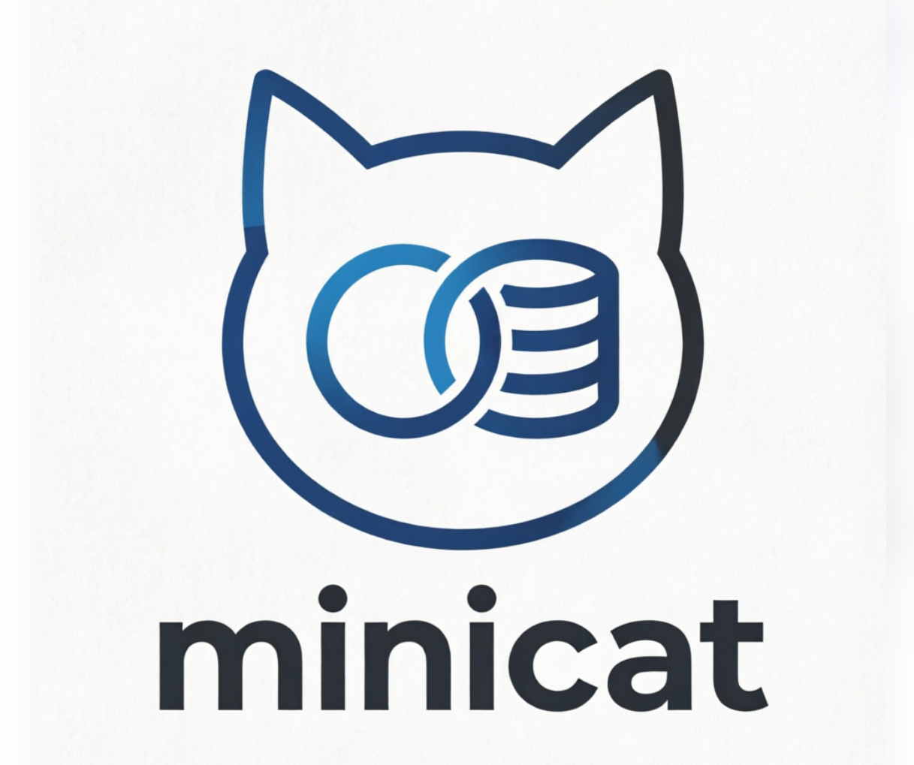

# 🐱 MiniCat - 轻量级Web数据库管理工具

<div align="center">



**一个简单、轻量的Web版数据库管理工具，类似Navicat的本地版本**

[](https://openjdk.java.net/)
[](https://spring.io/projects/spring-boot)
[](https://vuejs.org/)
[](LICENSE)

</div>

---

## 📖 项目简介

MiniCat 是一个基于 Web 的数据库管理工具，提供直观的图形界面来管理你的数据库。支持多种数据库类型，让数据库操作变得简单高效。

### ✨ 主要特性

- 🎯 **多数据库支持**: MySQL, PostgreSQL, H2 等
- 🖥️ **现代化界面**: 基于 Vue3 + Element Plus 的美观UI
- 🔒 **安全可靠**: SQL注入防护、密码加密存储
- ⚡ **高性能**: 使用 HikariCP 连接池优化性能
- 📊 **数据可视化**: 直观的数据表格展示和查询结果
- 🔍 **智能查询**: 支持SQL编辑器和格式化
- 🚀 **快速部署**: 支持Docker、JAR包等多种部署方式

---

## 🚀 快速开始

### 方式一：使用启动脚本（推荐新手）

#### Linux/Mac 用户
```bash
# 克隆项目
git clone https://gitee.com/zhuyuebin/mini-cat.git
cd MiniCat

# 赋予执行权限
chmod +x start.sh

# 一键启动
./start.sh
```

#### Windows 用户
```bash
# 克隆项目
git clone https://gitee.com/zhuyuebin/mini-cat.git
cd MiniCat

# 双击运行或在命令行执行
start.bat
```

启动成功后，访问: **http://localhost:8888**

---

### 方式二：使用 Docker（最简单）

```bash
# 克隆项目
git clone https://gitee.com/zhuyuebin/mini-cat.git
cd MiniCat

# 一键启动
docker-compose up -d
```

查看日志:
```bash
docker-compose logs -f
```

停止服务:
```bash
docker-compose down
```

访问: **http://localhost:8888**

---

### 方式三：手动构建（开发者）

#### 前置要求

- JDK 17 或更高版本
- Maven 3.6+
- Node.js 20+ (仅开发模式需要)

#### 构建步骤

```bash
# 1. 克隆项目
git clone https://gitee.com/zhuyuebin/mini-cat.git
cd MiniCat

# 2. 构建项目（自动构建前端）
mvn clean package -DskipTests

# 3. 运行应用
java -jar target/minicat-server-0.0.1-SNAPSHOT.jar
```

访问: **http://localhost:8888**

---

### 方式四：前后端分离开发模式

#### 启动后端

```bash
cd MiniCat
mvn spring-boot:run
```

#### 启动前端

```bash
cd MiniCat-Frontend
npm install
npm run dev
```

前端访问: **http://localhost:5173**  
后端API: **http://localhost:8888**

---

## 📋 功能说明

### 当前支持的功能

- ✅ 数据库连接管理（添加、编辑、删除）
- ✅ 数据库表浏览
- ✅ SQL查询执行
- ✅ 数据表格展示
- ✅ 连接池监控
- ✅ 密码加密存储
- ✅ SQL注入防护

### 计划中的功能

- 🔄 数据导入/导出
- 🔄 ER图生成
- 🔄 数据对比工具
- 🔄 查询历史记录
- 🔄 多标签页支持

---

## 🛠️ 技术栈

### 后端
- **框架**: Spring Boot 3.5
- **安全**: Spring Security
- **数据库**: H2 (元数据存储), MySQL/PostgreSQL (目标数据库)
- **连接池**: HikariCP
- **ORM**: Spring Data JPA

### 前端
- **框架**: Vue 3.5
- **UI库**: Element Plus
- **状态管理**: Pinia
- **路由**: Vue Router 5
- **HTTP客户端**: Axios
- **构建工具**: Vite

---

## 📁 项目结构

```
MiniCat/
├── src/main/java/com/minicat/     # 后端源代码
│   ├── controller/                # REST API控制器
│   ├── Services/                  # 业务逻辑层
│   ├── ServiceImpls/              # 服务实现
│   ├── repository/                # 数据访问层
│   ├── entity/                    # 实体类
│   ├── dto/                       # 数据传输对象
│   ├── Utils/                     # 工具类
│   ├── config/                    # 配置类
│   └── exception/                 # 异常处理
├── MiniCat-Frontend/              # 前端项目
│   ├── src/
│   │   ├── views/                 # 页面组件
│   │   ├── components/            # 通用组件
│   │   ├── api/                   # API调用
│   │   ├── stores/                # 状态管理
│   │   └── router/                # 路由配置
│   └── public/                    # 静态资源
├── data/                          # H2数据库文件
├── Dockerfile                     # Docker构建文件
├── docker-compose.yml             # Docker编排文件
├── start.sh                       # Linux启动脚本
└── start.bat                      # Windows启动脚本
```

---

## ⚙️ 配置说明

### 修改端口

编辑 `src/main/resources/application.properties`:
```properties
server.port=8080  # 修改为你想要的端口
```

### 数据库配置

MiniCat 使用 H2 数据库存储连接配置信息，默认配置文件位于 `src/main/resources/application-dev.properties`。

### 生产环境配置

创建 `application-prod.properties`:
```properties
server.port=8080
spring.datasource.hikari.maximum-pool-size=20
logging.level.root=WARN
```

---

## 🔧 常见问题

### 1. 端口被占用

**问题**: 启动时提示端口8080已被占用

**解决**: 
- 修改 `application.properties` 中的端口号
- 或者关闭占用8080端口的程序

### 2. Java版本不兼容

**问题**: 提示Java版本错误

**解决**: 确保安装了JDK 17或更高版本
```bash
java -version  # 检查Java版本
```

### 3. 前端无法连接后端

**问题**: 前端页面显示连接错误

**解决**: 
- 确保后端已启动在8080端口
- 检查 `MiniCat-Frontend/vite.config.js` 中的代理配置

### 4. Docker构建失败

**问题**: Docker构建过程中出错

**解决**:
```bash
# 清理Docker缓存
docker system prune -a

# 重新构建
docker-compose build --no-cache
```

---

## 📄 开源协议

本项目采用 MIT 协议 - 查看 [LICENSE](LICENSE) 文件了解详情

---

## 📮 联系方式

- 项目地址: [https://gitee.com/zhuyuebin/mini-cat](https://gitee.com/zhuyuebin/mini-cat)
- 问题反馈: [877119246@qq.com](https://gitee.com/zhuyuebin/mini-cat/issues)

---

## ⭐ Star History

如果这个项目对你有帮助，请给它一个 Star ⭐

---

<div align="center">

**Made with ❤️ by MiniCat Team**

</div>
